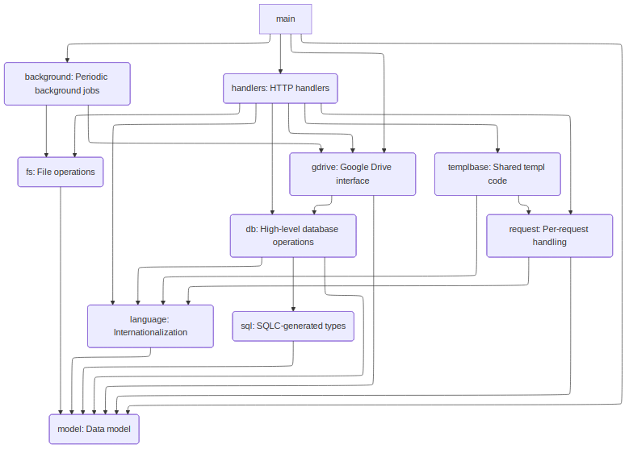

# bino

bino is a web application for managing patients in distributed wildlife rescues that have many independent facilities/shelters (referred to as "homes").

For now, bino uses Google Drive for actual patient journals, and users must have Google accounts.

## Development

* [go](https://go.dev/dl/) - programming language
* [postgresql](https://www.postgresql.org/download/) - database
* [just](https://github.com/casey/just) - command runner
* [sass](https://sass-lang.com/install/) - generates CSS from SCSS
* [sqlc](https://docs.sqlc.dev/en/stable/tutorials/getting-started-postgresql.html) - generates Go code from SQL
* [templ](https://templ.guide/) - HTML templating system for Go

### Architecture

This is a backend-heavy application; keeping data in sync between the server and client is usually
solved by having the page reload, either by a form or with `location.reload()`.
There are a few exceptions where the frontend is more interactive: searching and filtering, calendar, and wiki. Off the shelf libraries are used for this (TipTap, calendar.js, htmx).

#### Backend

The backend starts up a webserver and runs a few periodic background jobs
that keep the search index in sync and delete stale data (expired sessions and invitations). 

Operations in Google Drive are put on a task queue which is managed by a worker that has access to a service account. Other than that, there is hardly any concurrency at the application layer.

Currently the backend Go code is structured like this (only the most important/general packages are shown).
main lives in `cmd`, the other packages live in `internal`.



#### Frontend

Frontend source code is vanilla Typescript in `frontend` directory.

The code is compiled to javascript with esbuild. The compiled js and a few assets lives in `cmd/static`.

Frontend assets are accessed by the URL `/static/<buildKey>/<filename>` which maps to `cmd/static/bundle/<filename>` on the file system.
The build key is randomly generated each time the go code gets built, so as to bust the cache when there is a new build.

#### Generated code

All generated code *is* checked in! This makes the repo pretty big and could create conflicts if more than one person is working on the code,
but with the benefit is that you can easily rebuild the application on any other server (no need for sass, sqlc, templ, npm)

## Setup

This is only tested on Linux. Other Unixes and WSL should work too.

### Get the code

After you have installed all the prerequisites, clone the repository:

```sh
git clone git@github.com:fugleadvokatene/bino.git
```

### Config

Initialize your config

```sh
cp config.default.json config.json
```

Fields that need to be customized are marked with `<angle brackets>`.

### Database

Initialize the database:

```sh
just init_db
```

The database will be empty, but will be migrated up to the latest version when the application runs.

### Session key

Generate the key that is used to encrypt session cookies.

```sh
just session_key
```

TODO: generate session keys on-demand in the application.

### OAuth consent screen

You need to set up a project in Google Cloud Console and configure the [OAuth consent screen](https://developers.google.com/workspace/guides/configure-oauth-consent). This determines the `ClientID` field in the config.

Store the oauth credentials to `secret/oauth.json` (`secret/` is gitignore'd).

### Service account for Google Drive

Create a service account with access to the drive you are going to use.

Store the service account credentials to `secret/serviceaccount.json`.

Update the `DriveBase`, `JournalFolder`, `TemplateFile` and `ExtraJournalFolders` config fields with the respective IDs.

## Running

To build and run the application:

```sh
just run
```

There are also some other commands in the justfile if you want to just build or just
run sqlc etc.

